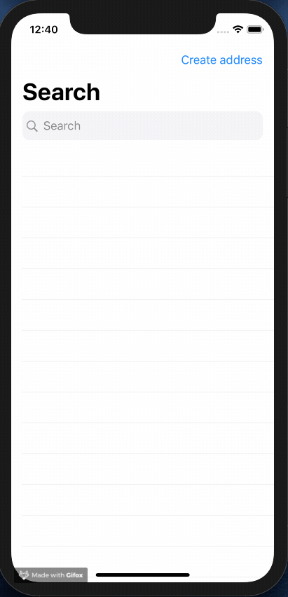
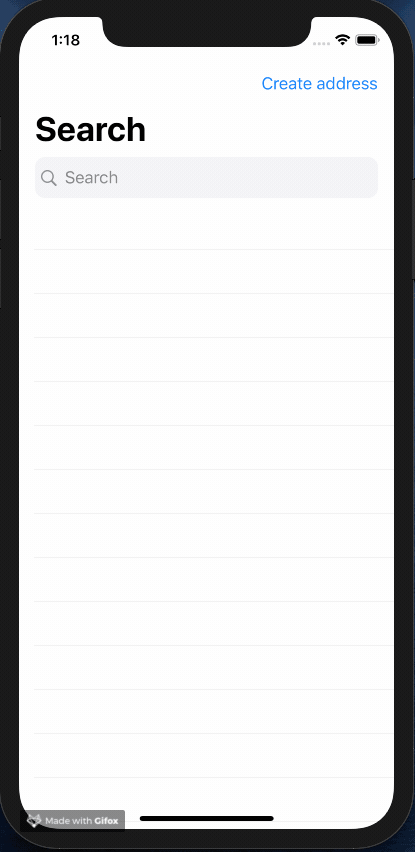

# AddressSearchDenmark-SwiftUI

> A simple app project utilizing Apple's SwiftUI and Combine framework built with the MVVM architecture

This project uses SwiftUI with SwiftUI Views, Views bridging to UIKit views, a network client that performs HTTP requests and structured using the MVVM (Model-View-ViewModel) architecture pattern, so this setup could potentially be used in large scale production apps, of course depending on the needs of the given app.
 

## Search
* By typing in a search query the app can search for street addresses in Denmark using the [DAWA API](https://dawa.aws.dk).
* It uses a custom `SearchBar` component with an inline activity indicator.
* The [`SearchAddressViewModel`](AddressSearchDenmark/Views/SearchAddressViewModel.swift) handles input from the views text field using Apple's `Combine` framework. The `@Published` `searchText` property has a 500 millisec debounce rate and removal of duplicates to avoid spamming the external API.

## Draggable Card
* The `DraggableCard` component can be used to overlay data on top of some parent view. In this case it is used to display data about the selected address on top of the map view-
* `SwiftUI` features a `DragGesture` that is used to handle dragging of the card and animation is done with an `interpolatingSpring` animation to provide the feeling of the card snapping to the defined positions.

## Create Address
* Creating an address doesn't really make much sense in the real world but it is used here as an example on how to aggregate the result of multiple `Publishers` into one combined result/value in the [`CreateAddressViewModel`](AddressSearchDenmark/Views/CreateAddressViewModel.swift)
* The `Combine` frameworks features the `CombineLatest` which publishes the aggregated result of `titleValidation` and `subtitleValidation` into the `validationResult` which then publishes it result to any subscribers.

